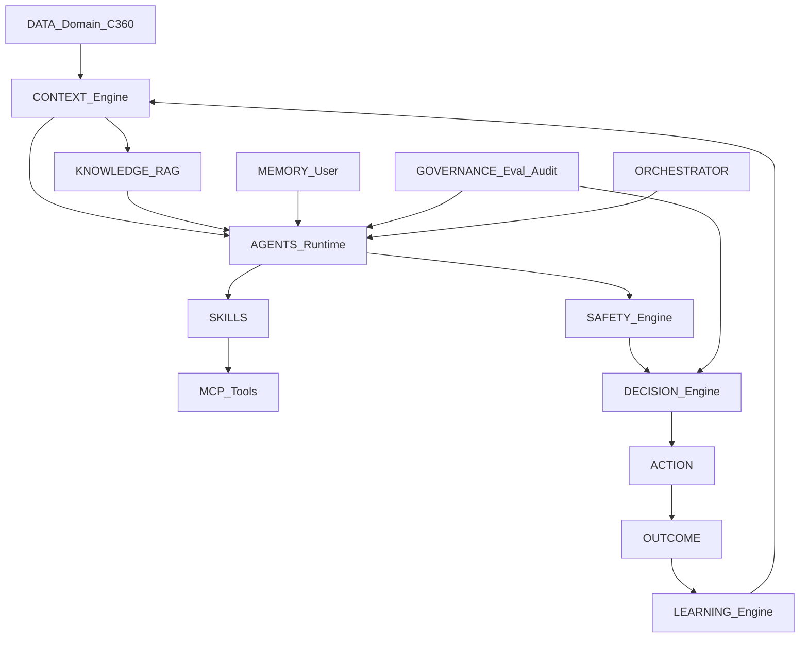
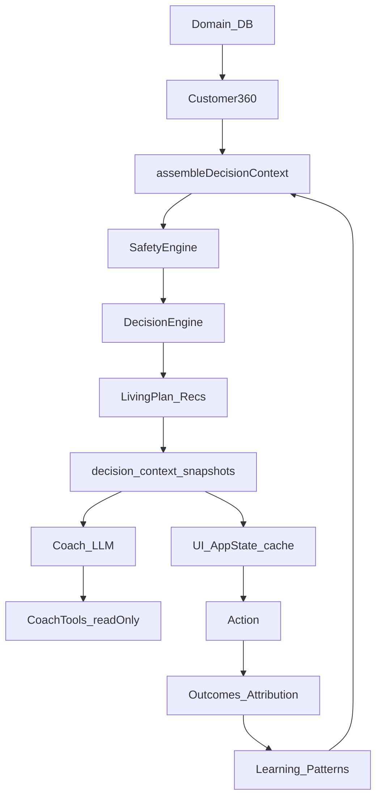

# AI Architecture — PERFORMANCE OS

Foundation document for the AI-native layer of Soldiers Fit Companion / Performance OS.

Related docs (do not replace):

- [performance-os-architecture.md](./performance-os-architecture.md)
- [intelligence-convergence.md](./intelligence-convergence.md)
- [decision-consolidation.md](./decision-consolidation.md)
- [DECISION_ENGINE.md](./DECISION_ENGINE.md)
- [decision-attribution.md](./decision-attribution.md)
- [learning-intelligence.md](./learning-intelligence.md)
- [LEARNING_ENGINE.md](./LEARNING_ENGINE.md)
- [architecture-identity-customer360.md](./architecture-identity-customer360.md)
- [CONTEXT_ENGINE.md](./CONTEXT_ENGINE.md)
- [MCP_ARCHITECTURE.md](./MCP_ARCHITECTURE.md)
- [SKILLS_ARCHITECTURE.md](./SKILLS_ARCHITECTURE.md)
- [RAG_ARCHITECTURE.md](./RAG_ARCHITECTURE.md)
- [MEMORY_ARCHITECTURE.md](./MEMORY_ARCHITECTURE.md)
- [ORCHESTRATOR.md](./ORCHESTRATOR.md)
- [AGENTS_ARCHITECTURE.md](./AGENTS_ARCHITECTURE.md)
- [COACH_AGENT.md](./COACH_AGENT.md)
- [AI_GOVERNANCE.md](./AI_GOVERNANCE.md)
- [AI_EVALUATION.md](./AI_EVALUATION.md)
- [AI_ARCHITECTURE_FINAL.md](./AI_ARCHITECTURE_FINAL.md)

---

## 1. Arquitetura atual (o que existe hoje)

### Stack

- TanStack Start + Vite + React
- Supabase (Postgres, Auth, Storage) — **sem** Edge Functions LLM
- `AppState` local-first (`src/lib/store.tsx`) + sync server
- LLM via TanStack `createServerFn` (OpenAI / Anthropic)

### Camadas reais

| Camada | Status | Paths |
|--------|--------|-------|
| Identity / AuthZ | Existe (FASE2) | `session-identity.server.ts`, `security-access-matrix.ts`, access cookie HMAC, `security-authz.ts` |
| Domain data | Existe | sync / hydrate, tabelas de domínio (service_role) |
| Customer360 | Existe | `src/lib/customer360/` |
| Context Engine | Existe (consolidado) | `performance-context.ts`, `context-engine.ts`, `assemble-decision-context.ts` — ver [CONTEXT_ENGINE.md](./CONTEXT_ENGINE.md) |
| Safety Engine | Existe | `src/lib/engine/safety.ts`, `learning-guardrails.ts` |
| Decision Engine | Existe (autoridade; contrato consolidado) | `decision.ts`, `decision-contract.ts`, `decision-proposal.ts` — ver [DECISION_ENGINE.md](./DECISION_ENGINE.md) |
| Living Plan / Recs | Existe | `living-plan*.ts`, `recommendation.ts` |
| Learning | Existe | `src/lib/engine/learning/`, `outcome-learning.ts`, `attribution.ts` |
| Behavior | Existe | `src/lib/engine/behavior/` |
| Recovery / Training / Nutrition | Existem | `engine/recovery/`, `src/lib/training/`, `src/lib/nutrition/` |
| Coach (LLM) | Migrando → Coach Agent | `runCoachAgent` — ver [COACH_AGENT.md](./COACH_AGENT.md); legado `src/lib/coach/` |

| Coach tools | Parcial (read-only allowlist) | `src/lib/coach/tools.ts` |
| Memory | Existe (FASE 9 layer) | `src/ai/memory/` + `ai_*` — ver [MEMORY_ARCHITECTURE.md](./MEMORY_ARCHITECTURE.md); legado `coach_memories` |
| MCP / Tool Layer | Existe (FASE 2 interna) | `src/ai/mcp/` — ver [MCP_ARCHITECTURE.md](./MCP_ARCHITECTURE.md); protocolo MCP transport ainda ausente |
| RAG / Knowledge | Existe (FASE 4 infrastructure) | `src/ai/rag/` — ver [RAG_ARCHITECTURE.md](./RAG_ARCHITECTURE.md) |
| Agent Runtime | Existe (thin FASE 7) | `runSpecialistAgent` — ver [AGENTS_ARCHITECTURE.md](./AGENTS_ARCHITECTURE.md) |
| Specialist Agents | Existe (5) | Performance, Training, Nutrition, Recovery, Behavior |

| Agent Orchestrator | Existe (FASE 6 plan-only) | `src/ai/orchestrator/` — ver [ORCHESTRATOR.md](./ORCHESTRATOR.md) |
| Skills (genéricos) | Existe (FASE 3 framework) | `src/ai/skills/` — ver [SKILLS_ARCHITECTURE.md](./SKILLS_ARCHITECTURE.md) |
| AI Governance / Evaluation formal | **Presente** + persist FASE 11 | `src/ai/governance/` + `ai_audit_events` — [AI_GOVERNANCE.md](./AI_GOVERNANCE.md) |

### Pasta `src/ai/` (esta fundação)

Contratos, Tool Layer MCP-compatible e boundaries. **Sem** Agent Runtime, RAG ou transport MCP protocol.

```
src/ai/
  contracts/     # tipos + reexports do engine
  agents/
  skills/
  rag/
  memory/
  mcp/
  orchestrator/
  governance/
```

### Princípio operacional atual (docs de convergência)

Engines determinísticos **calculam** → Decision Engine **escolhe** → Coach/LLM **explica** → UI **não recalcula** decisão autoritativa.

---

## 2. Arquitetura futura (alvo)

```
DATA
  → CONTEXT
  → KNOWLEDGE (RAG)
  → AGENTS
  → SKILLS
  → SAFETY
  → DECISION
  → ACTION
  → OUTCOME
  → LEARNING
  → NEXT DECISION
```

### Fluxo alvo



### Papéis futuros

| Módulo | Responsabilidade |
|--------|------------------|
| Context Engine | Interpretar dados observados/derivados → `PerformanceContext` |
| Knowledge / RAG | Fornecer chunks de conhecimento geral/produto |
| Memory | Histórico e preferências do usuário (`UserMemory`) |
| Agents | Coach + specialists; propoem/explicam via tools |
| Skills | Capacidades versionadas invocadas por agents |
| MCP | Boundary autenticado de Tools |
| Safety | Gates antes de decisões/ações críticas |
| Decision | Autoridade final de produto |
| Orchestrator | Roteamento e composição de AgentRuns |
| Governance | Auditabilidade + evaluation |
| Learning | Outcomes → priors para o próximo Context |

---

## 3. Boundaries e responsabilidades

| Boundary | Regra |
|----------|--------|
| LLM | Nunca é autoridade final sobre estado crítico |
| Agents | Não acessam banco diretamente |
| Agents | Usam Tools / MCP apenas |
| Skills | Não gravam diretamente no banco |
| Writes críticos | Autenticação + autorização obrigatórias |
| Safety | Precede decisões críticas |
| Decision Engine | Autoridade final de decisões de produto |
| UI | Sem regras críticas de negócio |
| Decisões importantes | Auditáveis |
| Agent runs | Rastreáveis (`AgentRun`) |
| Tool calls | Rastreáveis (`ToolCall`) |
| RAG | Conhecimento, não autoridade |
| Memory | Contexto do usuário, não knowledge geral |
| Engines em `src/lib/engine/` | Continuam sendo a implementação autoritativa até migração explícita |
| `src/ai/` | Superfície de contratos / boundaries; não duplica lógica |

---

## 4. Fluxo de dados (atual → fundação)

### Hoje



### Fundação `src/ai` (sem mudar o fluxo runtime)

- Contratos em `src/ai/contracts` reexportam `PerformanceContext`, `Decision`, `DecisionEvidence` do engine (SoT único).
- Novos tipos (`Agent`, `Skill`, `Tool`, …) preparam o runtime futuro sem implementá-lo.

---

## 5. Segurança

- Identidade confiável: cookie de acesso + `resolveTrustedIdentity` — nunca confiar em `userId` do body do client.
- `TrustedIdentity` inclui `userId`, `sessionId`, `role`, `permissions`, `tier`, `deviceId` (canal), opcional `clubId`.
- `device_id` **não** é identidade. Membership social por `user_id`.
- Cookie admin **não** autentica app user; Agents/Tools futuros usam `asTrustedUserId(toTrustedUserId(identity))` + `auditFromIdentity`.
- Matriz de acesso: PUBLIC / USER_PRIVATE / SOCIAL / COMMERCE / ADMIN / SYSTEM / ANALYTICS (`security-access-matrix.ts`).
- Contratos AI: `TrustedUserId` branded — ver `src/ai/contracts/trusted-user-id.ts`.
- Domínio: RLS + writes via server functions / `service_role`.
- Coach tools: allowlist read-only; rejeitam `userId` forjado.
- System prompt: sem diagnóstico médico/psicológico; turns medical → safety-first (`coach/classify.ts`).
- Learning guardrails: padrões clínicos não são promovidos a bias de decisão.
- Futuro MCP: tools com `requires_safety_gate` / `requires_decision_authority` nos contratos `Tool`.

Checklist permanente: ver também `SECURITY.md`, `docs/security-audit-identity-ai.md` e a seção Security de `performance-os-architecture.md`.

---

## 6. Agentes

| Conceito | Hoje | Futuro (`src/ai/agents`) |
|----------|------|---------------------------|
| Coach | `src/lib/coach/` (LLM + workflows determinísticos) | Coach Agent (`COACH_AGENT_ID`) |
| Specialists | Ausentes | training / nutrition / recovery / behavior |
| Runtime | — | Agent Runtime + `AgentRun` |
| Orchestrator | Framework FASE 6 (plan-only) | `src/ai/orchestrator` — ver [ORCHESTRATOR.md](./ORCHESTRATOR.md) |

Princípio: agents **explicam / propõem**; Decision Engine **decide**.

---

## 7. Skills

- Framework FASE 3 em `src/ai/skills/` — ver [SKILLS_ARCHITECTURE.md](./SKILLS_ARCHITECTURE.md).
- 19 skills determinísticas via Tool Layer; writes críticos → `SkillProposal` → Decision Engine.
- Workflows do coach (`src/lib/coach/workflows/*`) permanecem como ancestral de produto (migração futura).

---

## 8. MCP / Tool Layer

- Hoje: **Tool Layer interno** MCP-compatible em `src/ai/mcp/` (`invokeTool`, registry READ/WRITE, ToolCall audit).
- Coach tools allowlist continua em `src/lib/coach/tools.ts` até migração.
- Protocolo MCP (JSON-RPC / transport): **ainda não** — ver [MCP_ARCHITECTURE.md](./MCP_ARCHITECTURE.md).
- Futuro: `src/ai/mcp` registra Tools; toda invocação vira `ToolCall` auditável.

---

## 9. RAG

- Framework FASE 4 em `src/ai/rag/` — ver [RAG_ARCHITECTURE.md](./RAG_ARCHITECTURE.md).
- In-memory store + lexical embeddings; citations obrigatórias; sem corpus científico inventado.
- Distinto de Memory (`UserMemory` / `coach_memories`).

---

## 10. Memory

- Framework FASE 9 em `src/ai/memory/` — ver [MEMORY_ARCHITECTURE.md](./MEMORY_ARCHITECTURE.md).
- Quatro famílias: User / Decision / Outcome / Learning (`ai_*` tables, service_role only).
- Escrita só via API validada; LLM não grava direto. Distinto de RAG.
- Legado: `coach_memories` via `CoachMemoryEntry` (sem dual-write nesta fase).

---

## 11. Decisions

- SoT: Decision Engine + ledger (`recommendation_decisions`, snapshots).
- Contrato canônico: `Decision` / `DecisionEvidence` (reexportados em `src/ai/contracts`).
- UI consome selectors / snapshot — não inventa modo de treino.

---

## 12. Learning

- Pipeline: Decision → Action → Outcome → LearningEvent → LearningSignal → próximo Context.
- SoT: [`runLearningCycle`](../src/lib/engine/learning/run-learning.ts) — ver [LEARNING_ENGINE.md](./LEARNING_ENGINE.md).
- Contrato AI: `LearningEvent`, `Outcome`, `LearningOutcome` (distinto de `OutcomeKind` em `src/lib/outcome.ts`).
- Learning **nunca** sobrescreve Safety nem muta regras críticas do Decision Engine.
- Snapshot / Behavior (FASE 5): [learning-intelligence.md](./learning-intelligence.md).

---

## 13. Mapa hoje → amanhã

| Hoje | Amanhã |
|------|--------|
| `assembleDecisionContext` | Context + Safety + Decision (mesmo pipeline, superfície `src/ai`) |
| `PerformanceContext` / `Decision` (engine) | Reexport `src/ai/contracts` → eventual consumers AI-first |
| `src/lib/coach` | Coach Agent |
| `coach/tools.ts` | Tools + MCP |
| `coach_memories` | `UserMemory` |
| Workflows coach | Skills |
| — | RAG corpus |
| — | Orchestrator + Specialist Agents |
| Safety + authz | + Governance audit / Eval |

---

## 14. O que esta fundação **não** inclui

- Implementação de Agent Runtime, MCP server, RAG, orchestrator executável
- Mocks complexos ou dados fictícios
- Migração de engines ou Coach para `src/ai/`
- Alteração de UI, RLS, sync ou comportamento funcional
- Substituição de `performance-os-architecture.md`

---

## 15. Riscos e débitos (pré-existentes)

- Offline `offline_legacy` ainda pode reassembling no client
- Dois conceitos de “coach context” (engine legado vs `src/lib/coach`)
- Meal planner local até hydrate (doc de convergência)
- Sem Edge Functions; secrets/LLM só no server
- Dualidade de tipos Outcome (`src/lib/outcome.ts` vs contrato AI) — documentada; unificar em fase futura

### Riscos futuros (se a fundação for mal usada)

- Duplicar lógica de Decision/Safety dentro de agents
- Tratar RAG/Memory como autoridade
- Expor tools de write sem authz / Safety / Decision
- Migrar engines cedo demais sem dual-run / evaluation
