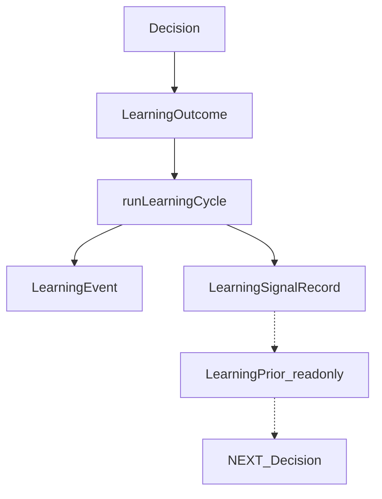

# Learning Engine

O Learning Engine formaliza o ciclo:

```
DECISION → ACTION → OUTCOME → LEARNING → NEXT DECISION
```

Ele **produz sinais**. Não modifica regras críticas automaticamente. O Decision Engine permanece a autoridade de como (e se) esses sinais entram no próximo Context / Decision.

## Autoridade

| Camada | Papel |
|--------|--------|
| Decision Engine | Emite `Decision`; consome priors / sinais com critério próprio |
| Safety | Acima de qualquer bias de Learning (`learningBiasAllowed`) |
| Learning Engine (`runLearningCycle`) | `LearningEvent` + `LearningSignalRecord` a partir de Outcome |
| Attribution / outcome-learning | Fontes de evidência legadas (FASE 5) |
| Living Plan | **Nunca** aplicado pelo Learning |

**Proibido no módulo:** mutar `decision-thresholds`, `computeDecisions`, apply Living Plan, inventar reason codes, LLM como fonte de sinais.

## Pipeline



API canônica: `runLearningCycle` em [`src/lib/engine/learning/run-learning.ts`](../src/lib/engine/learning/run-learning.ts).

## Contratos

### Decision (consumo)

Projection via `toLearningDecisionRef` a partir de `Decision` / `DecisionView`:

- `decisionId`, `userId`, `contextId`, `decisionType`, `engineVersion`
- `reasonCodes`, `evidence`, `confidence`, `safetyStatus`, `createdAt`

### LearningOutcome

```ts
{
  decisionId, action, adherence, result,
  measuredValue, expectedValue, quality, createdAt
}
```

`result`: `positive | negative | mixed | unknown | missing`  
`quality`: alinhado a Outcome AI (`success | fail | mixed | unknown | pending`)

Bridges: `fromAiOutcome` / `toAiOutcome`.

### LearningEvent

Kinds: `pattern_detected`, `pattern_reinforced`, `pattern_weakened`, `intervention_response`, `experiment_settled`, `attribution_recorded`, `bias_blocked`.

Inclui `engine_version` + `contract_version`. `blocked_by_guardrail` quando Safety impede bias.

### LearningSignalRecord

- `signal`: allowlist (`LEARNING_SIGNALS`) — ex. `volume_reduction_helps`
- `narrative`: template PT determinístico (não LLM)
- `confidence`, `blockedByGuardrail`, `engineVersion`

Exemplo: Decision `training_volume` ↓ → Outcome adesão 92% + recovery positiva → sinal `volume_reduction_helps` com narrativa *"redução de volume acessório parece eficaz sob recuperação moderada"*.

## Versionamento

| Constante | Valor |
|-----------|--------|
| `LEARNING_ENGINE_VERSION` | `"learning_v1"` |
| `LEARNING_CONTRACT_VERSION` | `1` |

## Status de ciclo

| Status | Quando |
|--------|--------|
| `learned` | Outcome válido → event + signal |
| `insufficient_outcome` | Outcome null / pending / missing — sem promoção de signal |
| `conflict` | Outcomes positivos e negativos no mesmo `decisionId` |
| `blocked` | Guardrail Safety / recovery impede bias (ex. sugerir ↑ volume) |
| `noop` | Sem signal key resolvível |

## Fail modes

- **Partial adherence** (0.5–0.85): confidence atenuada; quality pode ser `mixed`
- **Repeated decision** com outcome consistente: `pattern_reinforced` (+confidence)
- **Conflict**: confidence baixa; não promove regra nova
- **Regression**: ciclo não importa `computeDecisions` / thresholds

## Paths

| Peça | Path |
|------|------|
| Cycle | `src/lib/engine/learning/run-learning.ts` |
| Outcome | `src/lib/engine/learning/outcome.ts` |
| Events | `src/lib/engine/learning/events.ts` |
| Signals | `src/lib/engine/learning/signals.ts` |
| Version | `src/lib/engine/learning/version.ts` |
| Guardrails | `src/lib/engine/learning-guardrails.ts` |
| AI surface | `src/ai/contracts/learning-event.ts` (+ reexports) |
| Snapshot legado | `computeLearningSnapshot` (FASE 5 patterns / interventions) |

## Explicitamente fora

- ML / auto-tune de regras críticas
- Dual-write Memory
- Redesign UI / Coach
- Segundo motor em `src/ai/learning/`

## Ver também

- [learning-intelligence.md](./learning-intelligence.md) — snapshot / Behavior (FASE 5)
- [DECISION_ENGINE.md](./DECISION_ENGINE.md)
- [decision-attribution.md](./decision-attribution.md)
- [AI_ARCHITECTURE.md](./AI_ARCHITECTURE.md) § Learning
